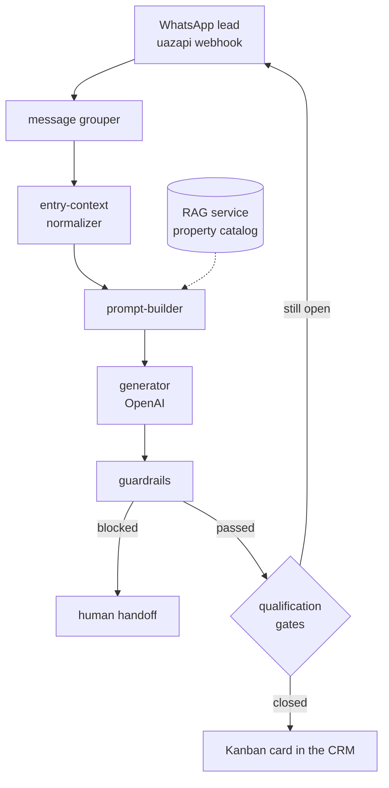

<h1 align="center">Pablo Tadini Soto</h1>

  <strong>Full-stack engineer</strong> · Paraná, Brazil

  I build the systems small companies run their entire operation on — 
  multi-tenant CRMs, desktop ERPs, and AI agents that talk to real customers. 
  <strong>Four of them are in production with paying clients right now.</strong>

  
  
  

  📫 <strong>Open to freelance projects and contract work</strong> · 🇧🇷 Atendo em português e inglês

---

## 🚀 Live in production

Real systems with real users — three reachable on the open web, one installed on a client's machines.

| System | What it runs | Stack |
|---|---|---|
| **[aggos.com.br](https://aggos.com.br)** | Multi-tenant CRM for custom-furniture retailers — 17-stage pipeline from lead to post-sale | Next.js · Supabase · Docker blue-green |
| **[crm.beambroker.com.br](https://crm.beambroker.com.br)** | Real-estate CRM with a WhatsApp AI agent that qualifies leads before a broker sees them | NestJS · Angular · Prisma · Redis |
| **[auraapp.online](https://auraapp.online)** | Web product with a native Flutter port sharing the same backend | PHP API · Flutter |
| **BarretoTransportesAPP** | Logistics ERP installed on a freight company's Windows machines, auto-updating | Electron · React 19 · Supabase |

Most of the code below is private client work. What I can show, I show.

---

## 🔍 Selected work

### AGGOS — multi-tenant CRM

Tracks a customer through **17 chained stages** — lead intake → pre-sale → contract → finance → measurement → manufacturing → delivery → scheduled review — with per-tenant isolation enforced in the database, not in the app layer.

`Next.js (App Router)` `TypeScript` `Supabase Postgres + RLS` `Zustand` `Vitest` `Playwright`

> **The hard part — deploying to a machine a business is actively using.** The deploy script always ships to the **inactive** color and never touches the live one. The running version stays up as both the rollback target *and* the drain path for in-flight connections; nginx flips only after the new color passes a health check. Images are built in CI and pulled from GHCR — nothing is ever built on the VPS, so a bad `npm install` can't take the site down.

`57 numbered SQL migrations` · `63 test files` · `216 commits` · e2e runs against an isolated tenant

---

### Beam Broker — WhatsApp AI qualification

An AI agent ("Marina") handles inbound real-estate leads over WhatsApp. A lead only becomes a card on the broker's Kanban once qualification actually closes — the model never decides that on its own.

`NestJS` `Prisma` `PostgreSQL 16` `Angular (standalone, signals)` `Redis` `MinIO` `OpenAI`

> **The hard part — an LLM talking to paying customers can't be "mostly right".** The AI service is split into `entry-context → prompt-builder → generator → guardrails`, with **deterministic gates** driving state transitions instead of the model. Prompt changes go through an offline eval harness: scenario fixtures (impatient lead, budget mismatch, discount negotiator, empty catalog, human-handoff request), a written rubric, and dated rounds with recorded findings. A persona change is measured before it ships, not eyeballed after.

Three services, ~81k LOC · `65 migrations` · separate RAG service for catalog retrieval · Docker Compose + nginx on VPS

Lead pipeline

---

### BarretoTransportesAPP — logistics ERP

Replaced the spreadsheets a freight company was running on. Windows desktop app plus a WhatsApp bot sharing one database. Modules: fiscal, financial, logistics, operations, registry, admin.

`Electron` `React 19` `Vite` `Supabase` `Sentry` `BullMQ` `NSIS auto-update`

> **The hard part — desktop software you can't walk over and fix.** Auto-update means a broken release installs itself on the client's machine. So CI gates every release behind `tsc --noEmit` and the full Vitest suite, and **10 Playwright e2e specs drive the real built app** through login, base registrations, financial status math, logistics scheduling, quote→order, load scheduling and maintenance work orders. Brazilian **NF-e invoice XML is parsed directly**, so fiscal data is ingested rather than retyped.

`105 test files` · `52 migrations` · `174 commits` · shipping at v0.4.1 · public [release channel](https://github.com/Pasblinn/bugao-releases)

---

### Cloaker Detector — ad-fraud investigation

CLI that detects **cloaking**: landing pages that show one thing to an ad platform's reviewer and something else to real traffic.

`TypeScript` `Playwright` `pixelmatch` `sharp` `Vitest`

> **The hard part — you cannot detect a cloaker by fetching a page once.** The tool fetches the same URL as two identities (`bot` and `victim`) through different proxies, follows the full redirect chain, and compares the results four ways: DOM structural similarity, extracted feature signals, parked-page heuristics, and pixel-level screenshot diff. Tests run against a **local fixture server that deliberately cloaks** plus a forward-proxy fixture — so the detector is validated against a controlled adversary instead of whatever the live web served that day.

Every run produces an evidence bundle: both HTML captures, both screenshots, the egress IP each identity exited from, and a timestamped trace of every request, redirect, cookie and console error.

---

## 🌱 Open source

**[VPSMAP](https://github.com/Pasblinn/vpsmap)** — Every Docker UI shows you containers. Most of a real server isn't containers. VPSMAP merges Docker, systemd, listening ports and nginx vhosts into one live topology graph — and surfaces the routes that point at nothing. One Python file, standard library only, no agent and no database.

**[MeetScribe](https://github.com/Pasblinn/meet-scribe)** — Chrome extension that transcribes Google Meet by reading the native captions out of the DOM; no audio is ever recorded. Content script → service worker over an outbox that retries and only clears on ack, so a reload mid-meeting doesn't lose the transcript. Local IndexedDB history, TXT/Markdown export, optional AI summaries with your own API key.

---

<h2>🛠️ Also built</h2>

| Project | Notable engineering |
|---|---|
| **MetPet** | FastAPI + SQLAlchemy 2 + Alembic API — Argon2id hashes, JWT access with **opaque rotating refresh tokens stored as SHA-256**, idempotent swipes, `Idempotency-Key` on reports, radius feed that never exposes coordinates, hash-pinned dependency locks |
| **Barbearia43** | Flutter + Supabase gamification platform — 16 migrations of RLS policies, RPCs, triggers and team competitions (including a fix for recursive membership policies), 4 Edge Functions covering LGPD account deletion and invite tokens |
| **RJ Usinagem** | Electron production-order system for a machine shop — runs **fully offline on embedded Postgres (PGlite)**, printable A4 reports, mobile time-clock companion |
| **ALPR (vision)** | Highway license-plate reading with GPS coordinates — PRD, architecture and **ADRs recording why inference stays local on the operator's GPU** instead of the cloud |
| **Aura** | Flutter port of a live PHP web app reusing the existing backend via session cookies — **zero server changes**, verified with a smoke test against production |
| **Stride** | Flutter + Express + TypeORM activity tracker with live GPS route drawing and JWT refresh persistence · UTFPR, Mobile Devices |
| **MedCloud / ERPMAXIPROD** | Company technical challenges — React + Node + Postgres + Redis, and a .NET 8 / C# expense system |

---

## 🧭 How I work

- **Migrations are the schema.** Numbered SQL files committed to the repo — never a console click.
- **Tests exercise the real thing.** Playwright drives the built app, not a mock; the AI service is scored against fixtures with a written rubric.
- **Deploys are reversible before they're clever.** Blue-green with the previous version still warm beats a fast deploy you can't undo.
- **Secrets come from env vars or a secrets manager.** Never in the repo, never in a log line.
- **Decisions get written down.** ADRs when the choice was contested, PRDs when the scope was.

---

## 🧰 Stack

  
   
  

  Also fluent in: Prisma · SQLAlchemy · TypeORM · Tailwind · Vitest · Playwright · Pytest · 
  Supabase RLS &amp; Edge Functions · blue-green deploys on VPS · OpenAI &amp; Anthropic APIs · RAG · offline eval harnesses

---

## 🎓 Education

**Technology in Systems Analysis and Development**
Universidade Tecnológica Federal do Paraná (UTFPR) — Ponta Grossa

---

  📫 <a href="mailto:pablotadinidev@gmail.com">pablotadinidev@gmail.com</a> ·
  <a href="https://www.linkedin.com/in/pablotadinisoto/">LinkedIn</a>

<picture>
  <source media="(prefers-color-scheme: dark)" srcset="https://raw.githubusercontent.com/Pasblinn/Pasblinn/output/github-snake-dark.svg" />
  
</picture>

